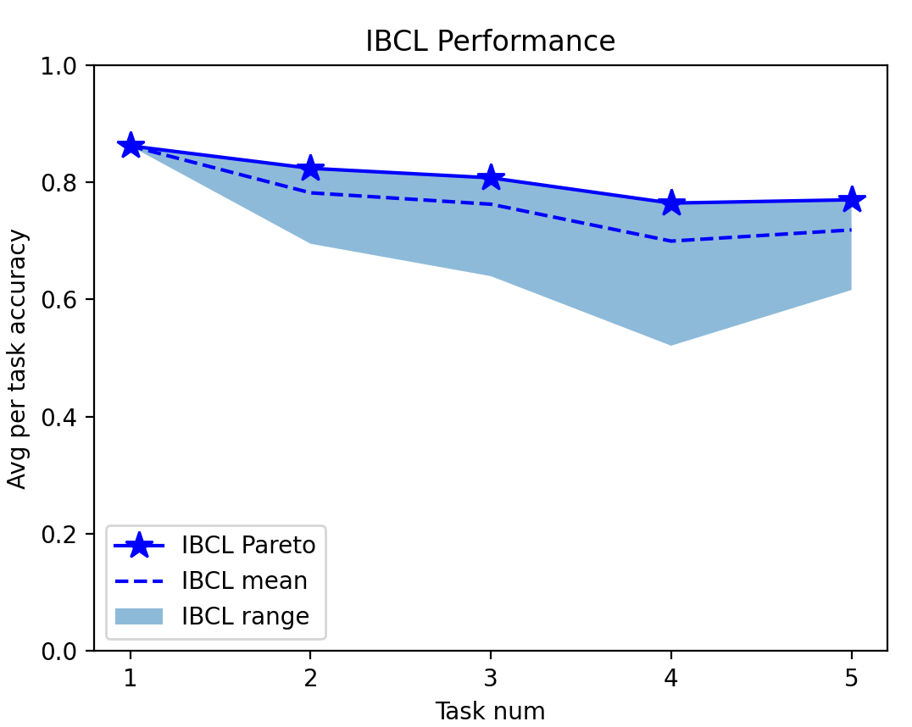
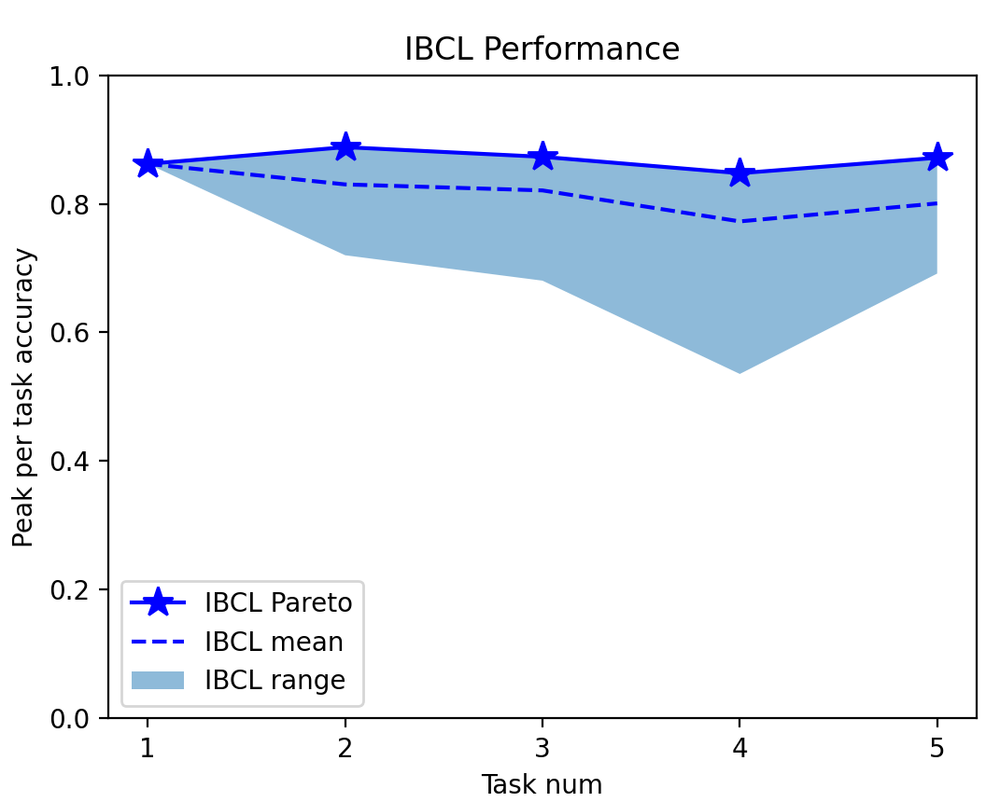
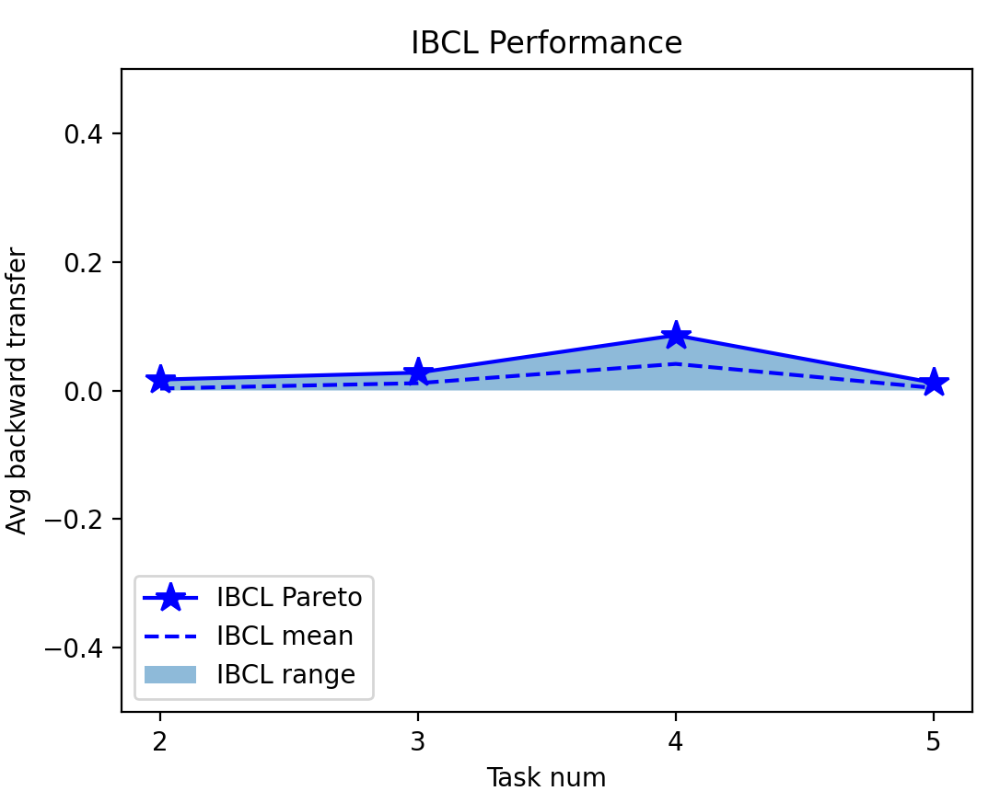
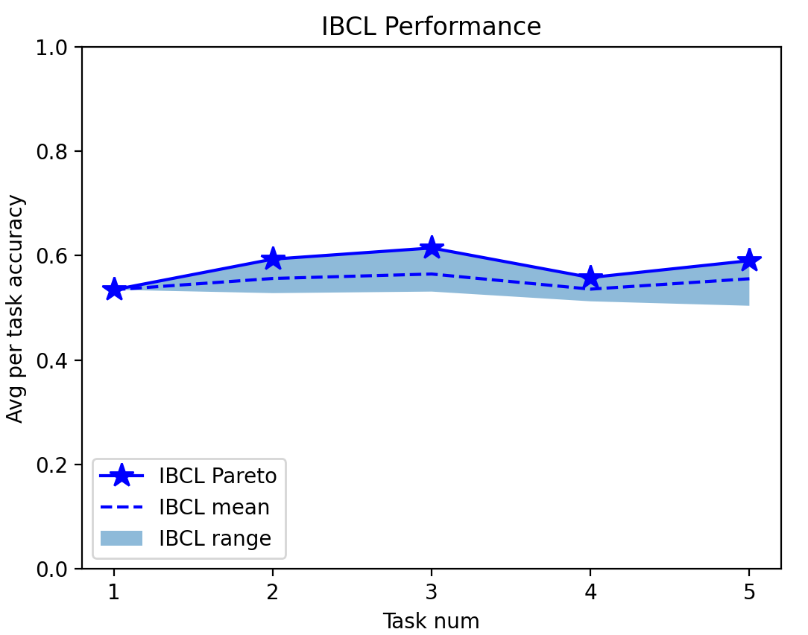
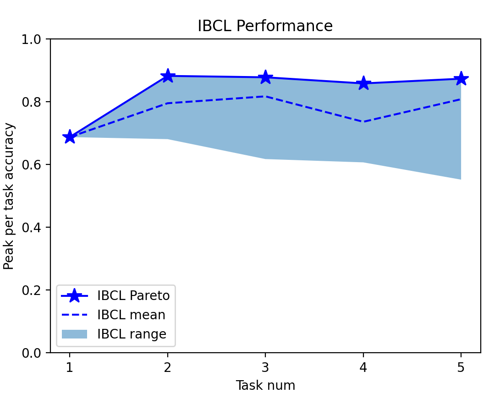
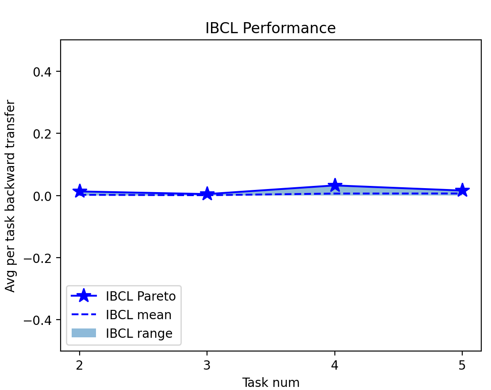
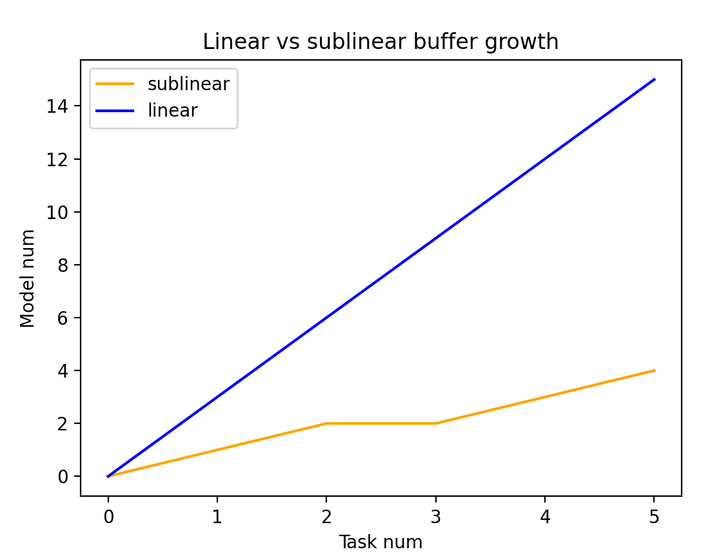

# IBCL Code

## Update 08/03/2023

We did some further modifications to this README.

1. Added captions to figures in this file.

## Update 08/02/2023

First, we debugged our code to make sure it is runnable. This includes:

1. Fixed module import errors by modifying the directory structure.

2. Fixed argument errors in `general_model` in `fgcs_update.py`.

3. Fixed type error of input arguments to `zero_shot_model_locate.py`.

4. Enabled flexible model sizes in `zero_shot_model_locate.py`.

5. Modified the instructions below accordingly, with an example use case `example_split_cifar10.sh`.

Next, we added a visualization script for the final results. Specifically,

6. Added Python script `visualize_results.py` and modified the instructions accordingly.

Finally, we added an alternative version that uses sublinear buffer growth. Specifically,

7. Added scripts `fgcs_update_sublinear.py` and `zero_shot_model_locate_sublinear.py`.
Enabled visualization of the sublinear growth result in `visualize_results.py`.

8. Reported the comparison between the sublinear and linear growth version on Split CIFAR-10.

9. Modified the instructions accordingly, with an example use case `example_split_cifar10_sublinear.sh`.


## Instructions of running our code

### 0. Prerequisites

To run the project, please install Python >= 3.8 and the packages in the requirements.txt file by running

```
pip install -r requirements.txt
```

### 1. Preparing data

To preprocess data for both Split CIFAR-10 and CelebA, run the following command.

```
python preprocess_data.py --task_name=<cifar10|celeba> --raw_data_dir=<path to your raw data dir> --proc_data_dir=<path to your proc data dir>
```

Notice that it is not necessary to creat these two directories beforehand, because this command will automatically create them, as long as the paths are valid.
This will first download raw CIFAR10 or CelebA data from their torchvision sources.
The downloaded raw data will be saved in a directory, and processed data will be stored in another.
The preprocessing include transform and feature extraction by a pre-trained ResNet18.
Notice that CelebA may be too large to be downloaded from torchvision directly. In this case, please refer to [this link](https://github.com/pytorch/vision/issues/2262) to manually download it from Google drive,
and set `download=False` for all 3 datasets in `download_celeba` in `utils/preprocess_utils.py`.

### 2. Training FGCS

To update FGCS knowledge base by training, run the following command.

```
python fgcs_update.py --task_name=<cifar10|celeba> --data_dir=<path to your proc data dir> --model_size=<small|normal|large>
```

We provide 3 different models (3 parameter spaces) for training. Their architectures are available in `models/models.py`. The default model is small.
For every task, this code will update the FGCS in `fgcs.pth` in the preprocessed data directory provided. FGCS across all tasks will be checkpointed in this file.
We also save a log of loss and a log of validation accuracy per epoch during training.

### 3. Zero-shot preference addressing

To locate model HDRs that address particular preferences, run the following command.

```
python zero_shot_model_locate.py --task_name=<cifar10|celeba> --data_dir=<your proc data dir> --model_size=<small|normal|large> --alpha=<a number between 0 and 1> --num_prefs_per_task=<number of preferences per task> --num_models_per_pref=<number of sampled models per preference>
```

This code will uniformly sample a number of preferences per task, except for the first task, which can only have preference = [1]. Then, for each preference, it computes an HDR and samples a number of models from the HDR.
It then evaluates the testing accuracy on all tasks encountered so far. The evaluated accuracy and sampled preferences will be saved in two dictionaries in the provided directory.
These results can be therefore used to compute metrics such as preference-weighted accuracy, average per-task accuracy, peak per-task accuracy and backward transfer.
Notice that we also provide a method `compute_pareto_front_two_tasks` to estimate the Pareto set of the first two tasks of a benchmark. This result can be visualized as Figure 2 and 3 in our paper.

### 4. Results visualization

| Avg per task accuracy       | Peak per task accuracy      | Avg per task backward transfer|
| ---------------------- | ---------------------- | ----------------------------- |
|  |  | |

<p style="text-align: center"><b>Figure 1: Example visualization after running `example_split_cifar10.sh`.</b></p>

We added a script to help visualize the continual learning metrics as we did in Figure 7 of Appendix I. This includes average per task accuracy,
peak per task accuracy and average per task backward transfer. To do so, run the following command.

```
python visualize_results.py --task_name=<cifar10|celeba> --data_dir=<your proc data dir> --alpha=<a number between 0 and 1>
```

This will fetch the accuracy `.pt` file saved from last step and produce 3 figures similar to the ones above.
These figures are produced under the configurations in `example_split_cifar10.sh`.
Notice that this code does not visualize baseline results for comparison yet, but we can add this function per request.


### 5. An example Split-CIFAR10 bash script

We have included an example run of the entire three steps on Split-CIFAR10 as a bash script `example_split_cifar10.sh`.
This script starts from preprocessing the data and ends up visualizing the results.
If calling this bash script does not work, please refer to the step-by-step instructions above to produce results.


## Sublinear buffer growth and additional experiment results

We would like to show that IBCL is not a naive expansion-based CL pipeline. That is, its buffer size is not linear in terms of
the number of tasks. Instead, we can easily extend it to sublinear growth. The idea is to discard a newly learned posterior $Q$ if we have identified
a buffered posterior $Q'$ that is very similar to it. In this case, we record the mapping $Q \mapsto Q'$ and use $Q'$ as a substitute of $Q$.
A concrete algorithm to learn the FGCS, on top of Algorithm 1 in our paper, is:

1. At task $i$, get $m$ priors from the buffer, $Q_{i-1}^1, \dots, Q_{i-1}^m$.

2. For each prior $Q_{i-1}^j$, learn its posterior $Q_{i}^j$ via variational inference on dataset of task $i$.

3. For each new posterior $Q_{i}^j$, for each buffered posterior $Q'$, compute 2-Wasserstein distance $||Q_{i}^{j} - Q'||\_{W_{2}}$.
Identify the buffered posterior $Q'\_{min}$ that has the smallest distance to $Q_{i}^j$.

4. If this smallest distance < a given threshold $\tau$, do not buffer $Q_i^j$ and record that $Q_i^j$ is substituted by $Q'_{min}$.
Otherwise, buffer $Q_i^j$ as another extreme point of the FGCS.

5. Update each prior for next task to either $Q_i^j$ or its substitute, if it is substituted.

In practice, since we assume all scalar parameters (weights and biases of the BNN) are Gaussians and they are independent of each other,
the 2-Wasserstein distance is equivalent to

$$ ||Q_{i}^j - Q'||\_{W_2} = ||\mu_{Q_i^j}^2 - \mu_{Q'}^2||\_2^2 + ||\sigma_{Q_i^j}^2 - \sigma_{Q'}^2||\_2^2 $$

where $\mu_{Q}$ and $\sigma_{Q}$ are the concatenated vector of the means and standard deviations of all the scalar parameter's Gaussian given by
a multivariate Gaussian $Q$.
Please refer to reference [12] in our paper for more detail. We can see there is one additional hyperparameter, i.e., distance threshold $\tau$.
This threshold's value can be estimated by computing the distances among all posteriors in the linear version.
Moreover, our implementation uses the same threshold for different BNN architectures, which have different number of parameters.to
To remove the affect of parameter number on the 2-Wasserstein distance, we normalize all distances by the number of parameters.
This can be seen in the computation of `dist` in `fgcs_update_sublinear.py`.

Then, upon zero-shot preference addressing, we use the identified $Q'_{min}$ to substitute $Q_i^j$ when computing convex combinations.
We provide an example bash script `example_split_cifar10_sublinear.sh` on Split CIFAR-10.
Based on this script, we compare the result between linear and sublinear buffer growths.

Buffer growth | Avg per task accuracy       | Peak per task accuracy      | Avg per task backward transfer|
--------------| ---------------------- | ---------------------- | ----------------------------- |
Linear |  |  | |
Sublinear |  |  | |

<p style="text-align: center"><b>Figure 2: Comparison of continual learning performance metrics between linear and sublinear IBCL on Split CIFAR-10.</b></p>

We can see there is a trade-off between buffer efficiency and continual learning performance.
However, the peak per task accuracy is barely harmed in this case, and the backward transfer still remains consistently positive, meaning
that the model is not catastrophic forgetting. Moreover, a significant improvement is the buffer size growth, as shown below.

<p align="center">
    
</p>

<p style="text-align: center"><b>Figure 3: Comparison of buffer growth between linear and sublinear IBCL on Split CIFAR-10.</b></p>


We are willing to run more experiments and analyze the trade-off between buffer efficiency (e.g. quantified by $\tau$)
and learning performance in IBCL. If we have a chance to make a camera-ready version, we will include additional experiments and discussion.
Furthermore, more sophisticated sublinear buffer growth algorithms can be used for comparison, such as gift-wrapping algorithm [1] and other efficient convex hull
optimization methods.

[1] Chan, Timothy M. "Optimal output-sensitive convex hull algorithms in two and three dimensions." Discrete & Computational Geometry 16.4 (1996): 361-368.
